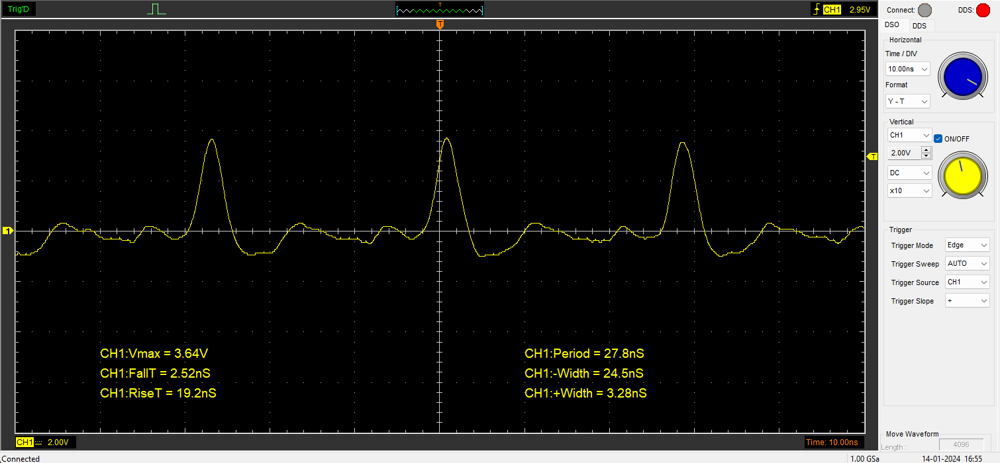
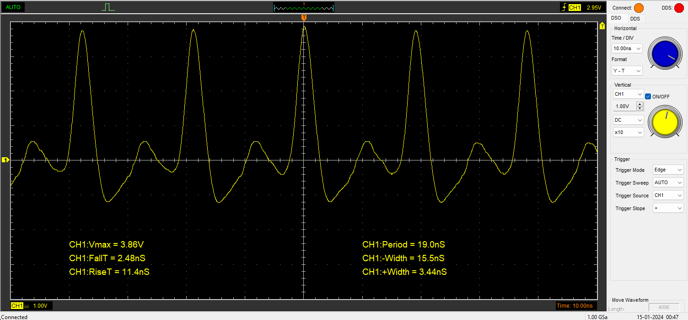

# Measurements
Detailed below are measurements performed on a Teensy 4.1 running the latest (performance changing) firmware.<br>
The measuring equipment is a [Hantek 6254BD](https://www.hantek.eu/product/hantek-6254bd/) USB oscilloscope.<br>
|  Bandwidth 1ch/2ch  |  RT Sampling Rate   | Vertical Resolution |
| ------------------- | ------------------- | ------------------- |
|   250Mhz / 200Mhz   |       1GSa/s        |        8bit         |

## Single pin measurements
These tests were performed on a single pin, their focus is measuring speed and consistency.<br>
The Teensy 4.1 board is powered from the microUSB port, and has a uart<->USB adapter connected to pads 0, 1, gnd.

### Test 1a: queue speed (with trigger)
This test is a simple measurement of the lowest possible offset, width and queue switching speed.
#### Parameters
Command: ```glitch_add driver=15 trigger=9 trigger_state=0 offset=1 width=1 override=1 clockspeed=792000000```
 - queue: single glitch, glitch->next = glitch (loop)
 - driver: pad 15 -> high, header connected to the x10 channel 1 probe 
 - trigger: pad 9 low, header connected to teensy gnd
 - core frequency: 792Mhz
#### Results
Single captures, scope trigger at 2.95v:
|  n0  | Width +/- [ns] | Rise / Fall [ns] | Vmax [V] |
| ---- | -------------- | ---------------- | -------- |
|   1  |  3.20 / 24.5   |    19.9 / 2.56   |   3.70   |
|   2  |  3.28 / 24.6   |    19.0 / 2.52   |   3.70   |
|   3  |  3.28 / 24.5   |    19.0 / 2.44   |   3.64   |
|   4  |  3.20 / 24.6   |    19.0 / 2.52   |   3.64   |
|   5  |  3.20 / 24.6   |    18.9 / 2.52   |   3.64   |
|   6  |  3.28 / 24.5   |    19.0 / 2.56   |   3.70   |

Long:


### Test 1b: queue speed (without trigger)
This test is a simple measurement of the lowest possible offset, width and queue switching speed. The trigger is replaced by a DTCM memory read and compare.
#### Parameters
Command: ```glitch_add driver=15 no_trigger=1 offset=1 width=1 override=1 clockspeed=792000000```
 - queue: single glitch, glitch->next = glitch (loop)
 - driver: pad 15 -> high, header connected to the x10 channel 1 probe 
 - trigger: n/a (dtcm memory readcmp)
 - core frequency: 792Mhz
#### Results
Single captures, scope trigger at 2.95v:
|  n0  | Width +/- [ns] | Rise / Fall [ns] | Vmax [V] |
| ---- | -------------- | ---------------- | -------- |
|   1  |  3.44 / 15.4   |    11.9 / 2.56   |   3.80   |
|   2  |  3.36 / 15.6   |    11.1 / 2.52   |   3.83   |
|   3  |  3.44 / 15.4   |    11.7 / 2.64   |   3.83   |
|   4  |  3.44 / 15.5   |    11.5 / 2.56   |   3.80   |
|   5  |  3.44 / 15.5   |    11.2 / 2.52   |   3.76   |
|   6  |  3.44 / 15.5   |    11.4 / 2.52   |   3.76   |

Long:


### Test 2: width
This test measures the length, consistency and curve of pulse width. The trigger is replaced by a DTCM memory read and compare.
#### Parameters
Command: ```glitch_add driver=15 no_trigger=1 offset=1 override=1 clockspeed=792000000 width=X```
 - queue: single glitch, glitch->next = glitch (loop)
 - driver: pad 15 -> high, header connected to the x10 channel 1 probe 
 - trigger: n/a (dtcm memory readcmp)
 - core frequency: 792Mhz
#### Results
Avg/Long captures, scope trigger at 2.7v:
| X | Width +/- [ns] | Rise / Fall [ns] | Vmax [V] |
| --- | --- | --- | --- |
| 1 | 3.36 / 15.5 | 11.5 / 2.56 | 3.76 |
| 2 | 9.52 / 17.0 | 12.6 / 6.64 | 4.96 |
| 5 | 13.9 / 16.5 | 12.6 / 10.7 | 5.02 |
| 8 | 17.6 / 16.5 | 13.6 / 14.6 | 4.96 |
| 10 | 20.0 / 16.6 | 13.3 / 17.0 | 4.96 |
| 20 | 32.6 / 16.5 | 13.3 / 29.6 | 4.96 |
| 50 | 70.6 / 16.6 | 13.3 / 67.5 | 4.83 |
| 80 | 108 / 16.4 | 13.4 / 106 | 4.89 |
| 100 | 134 / 16.4 | 13.4 / 131 | 4.83 |
| 200 | 260 / 16.0 | 13.6 / 257 | 4.83 |
| 500 | 638 / 16.0 | 13.6 / 635 | 4.83 |
| 800 | 1020 / 16.0 | 14.0 / 1010 | 4.89 |

### Test 3a: offset
This test measures the consistency and curve of a glitch offset.
 - NOTE: The offset width here is a measure of time between the end of one pulse and start of the next one in the glitch chain.
   - so it includes end of one glitch entry, load of the next, branch, trigger check, offset
#### Parameters
Command (with trigger): ```glitch_add driver=15 trigger=9 trigger_state=0 override=1 clockspeed=792000000 width=10 offset=X``` <br>
Command (without trigger): ```glitch_add driver=15 no_trigger=1 override=1 clockspeed=792000000 width=10 offset=X```
 - queue: single glitch, glitch->next = glitch (loop)
 - driver: pad 15 -> high, header connected to the x10 channel 1 probe 
 - trigger: pad 9 low, header connected to teensy gnd, or n/a (dtcm memory readcmp)
 - core frequency: 792Mhz
#### Results
Avg/Long captures, scope trigger at 2.7v:
| X | TrigOffset width- [ns] | Offset width- [ns] |
| --- | --- | --- |
| 1 | 25.5 | 16.6 |
| 2 | 34.4 | 25.4 |
| 5 | 38.0 | 31.8 |
| 8 | 45.6 | 39.4 |
| 10 | 50.7 | 44.4 |
| 20 | 76 | 69.6 |
| 50 | 152 | 146 |
| 80 | 227 | 221 |
| 100 | 278 | 272 |
| 200 | 530 | 524 |

### Test 3b: offset mult
This test measures the consistency and curve of a glitch offset multiplier.
 - NOTE: The offset width here is a measure of time between the end of one pulse and start of the next one in the glitch chain.
   - so it includes end of one glitch entry, load of the next, branch, trigger check, offset
#### Parameters
Command: ```glitch_add driver=15 no_trigger=1 override=1 clockspeed=792000000 width=10 offset=X offset_mult=Y```
 - queue: single glitch, glitch->next = glitch (loop)
 - driver: pad 15 -> high, header connected to the x10 channel 1 probe 
 - trigger: n/a (dtcm memory readcmp)
 - core frequency: 792Mhz
#### Results
Avg/Long Width- captures, scope trigger at 2.7v:
| X\Y | 1 | 2 | 5 | 10 | 20 | 100 |
| --- | --- | --- | --- | --- | --- | --- |
| 1 | 16.6 ns | 28.0 ns | 39.4 ns | 58.4 ns | 96.2 ns | 399 ns |
| 2 | 25.4 ns | 45.6 ns | 88.6 ns | 158 ns | 297 ns | 1410 ns |
| 5 | 31.8 ns | 59.6 ns | 125 ns | 232 ns | 447 ns | 2160 ns |
| 10 | 44.4 ns | 84.8 ns | 188 ns | 359 ns | 700 ns | 3425 ns |
| 20 | 69.6 ns | 135 ns | 314 ns | 611 ns | 1205 ns | 5950 ns |
| 100 | 272 ns | 539 ns | 1325 ns | 2630 ns | 5245 ns | 26150 ns |


## Double pin measurements
These tests were performed with the oscilloscope connected to both "trigger" and "driver" pins.
 - Note that the BW/SR becomes 200Mhz/500MSa per channel.
Trigger is driven by a DDS integrated into the oscilloscope. The wave is set to square, frequency 1khz, amplitude 1.65v and Y offset 1.65v. <br>
The Teensy 4.1 board is powered from the microUSB port, and has a uart<->USB adapter connected to pads 0, 1, gnd.

### Test 4a: logic high response time
This test measures the time between trigger high -> driver high.
 - NOTE: This is highly specific to the test setup and environment, more/less current could lead to more/less consistent results.
#### Parameters
Command: ```glitch_add driver=15 trigger=9 trigger_state=1 override=1 clockspeed=792000000 width=10 offset=1 queue=1```
 - queue: detect low -> detect high -> actual glitch
 - driver: pad 15 -> high, header connected to the x10 channel 1 probe 
 - trigger: pad 9 -> high, header connected to DDS and the x10 channel 2 probe
 - core frequency: 792Mhz
#### Results
Single captures, scope trigger at 2.95v:
|  n0  | H-H | P-P |
| ---- | --- | --- |
|   1  | 28.1 ns | 20 ns |
|   2  | 30 ns | 22 ns |
|   3  | 32 ns | 22.1 ns |
|   4  | 32.1 ns | 24 ns |
|   5  | 30 ns | 20 ns |
|   6  |  34 ns  | 24 ns |

### Test 4b: logic low response time
This test measures the time between trigger low -> driver high.
 - NOTE: This is highly specific to the test setup and environment, more/less current could lead to more/less consistent results.
#### Parameters
Command: ```glitch_add driver=15 trigger=9 trigger_state=0 override=1 clockspeed=792000000 width=10 offset=1 queue=1```
 - queue: detect high -> detect low -> actual glitch
 - driver: pad 15 -> high, header connected to the x10 channel 1 probe 
 - trigger: pad 9 -> low, header connected to DDS and the x10 channel 2 probe
 - core frequency: 792Mhz
#### Results
Single captures, scope trigger at 2.95v:
|  n0  | L-H | P(L)-P | P(H)-P |
| ---- | --- | --- | --- |
|   1  | 26.1 ns | 26.1 ns | 38.1 ns |
|   2  | 32.1 ns | 22.1 ns | 34.1 ns |
|   3  | 24 ns | 24 ns | 38 ns |
|   4  | 22 ns | 22 ns | 34.1 ns |
|   5  | 26 ns | 26 ns | 38.1 ns |
|   6  | 22 ns | 22.1 ns | 34.1 ns |