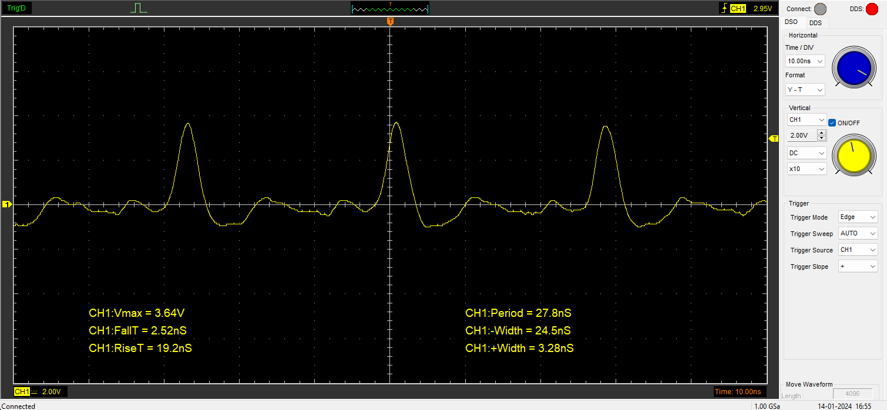

# Measurements
Detailed below are measurements performed on a Teensy 4.1 running the latest (performance changing) firmware.<br>
The measuring equipment is a [Hantek 6254BD](https://www.hantek.eu/product/hantek-6254bd/) USB oscilloscope.<br>
|  Bandwidth 1ch/2ch  |  RT Sampling Rate   | Vertical Resolution |
| ------------------- | ------------------- | ------------------- |
|   250Mhz / 200Mhz   |       1GSa/s        |        8bit         |

## Single pin measurements
These tests were performed on a single pin, their focus is measuring speed and consistency.<br>
The Teensy 4.1 board is powered from the microUSB port, and has a uart<->USB adapter connected to pads 0, 1, gnd.
### Test 1: queue speed (with trigger)
This test is a simple measurement of the lowest possible offset, width and queue switching speed.
#### Parameters
Command: ```glitch_add driver=15 trigger=9 trigger_state=0 offset=1 width=1 override=1 clockspeed=800000000```
 - queue: single glitch, glitch->next = glitch (loop)
 - driver: pad 15 -> high, header connected to the x10 channel 1 probe 
 - trigger: pad 9 low, header connected to teensy gnd
 - core frequency: 800Mhz
#### Results
Single trigger captures:
|  n0  | Width +/- [ns] | Rise / Fall [ns] | Vmax [V] |
| ---- | -------------- | ---------------- | -------- |
|   1  |  3.20 / 24.5   |    19.9 / 2.56   |   3.70   |
|   2  |  3.28 / 24.6   |    19.0 / 2.52   |   3.70   |
|   3  |  3.28 / 24.5   |    19.0 / 2.44   |   3.64   |
|   4  |  3.20 / 24.6   |    19.0 / 2.52   |   3.64   |
|   5  |  3.20 / 24.6   |    18.9 / 2.52   |   3.64   |
|   6  |  3.28 / 24.5   |    19.0 / 2.56   |   3.70   |

Long:


